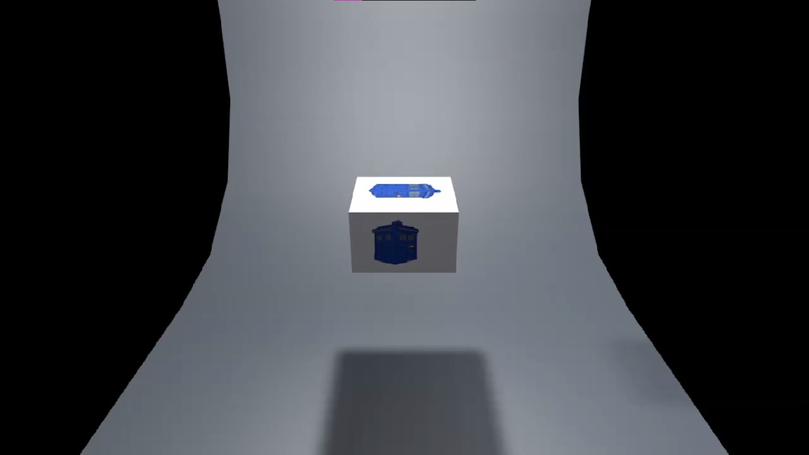

# Miriam Durán

## ¿Quién soy?
Soy una **estudiante** de 2º de DAW aprendiendo *Markdown*  y *Github pages*.

Mi instituto es el [Severo Ochoa en Elche](https://portal.edu.gva.es/03013224/es/inicio/).


## ¿Qué estoy aprendiendo?
Me gusta programar en Python:
``` python
aficiones= ["programar en python", "escribir relatos", "realizar actividades relacionadas con el diseño gráfico", "tocar el piano", "fotografía"]
print(aficiones)
```

Un comando muy importante es `python manage.py runserver`.

Otras tecnologías que he aprendido han sido:

* SQL
* Java básico
    1. Clases
    2. Colecciones
    3. Ficheros
* HTML y CSS
    * HTML5
* JavaScript
    * Arrays
* Python

Y los módulos que me han gustado han sido:

| Sí    | No
| ---   | ---
| BD    |Programación
|Desarrollo en Servidor | Diseño de Interfaces

## Diseño de packaging 3D

Antes de llevar a cabo cualquiera de mis ideas de packaging, siempre realizo pruebas con Cinema 4D para visualizar el funcionamiento real de mi packaging.

<video width="100%" height="100%" controls poster="videos/portadas/portada.jpg">
  <source src="videos/Final_Miriam_Duran_Cinema.mp4" type="video/mp4">
  <source src="videos/Final_Miriam_Duran_Cinema.ogg" type="video/ogg">
  
  Tu navegador no soporta vídeo
</video>

<br/>

## Diseño gráfico de elementos y maquetación de obra propia

<iframe width="100%" height="100%" src="https://www.youtube.com/embed/-W28t-UGl3o" title="NUEVO LIBRO - La Vida Tranquila" frameborder="0" allow="autoplay; clipboard-write; encrypted-media; picture-in-picture; web-share" allowfullscreen></iframe>

## Presentación interiores de la obra

<iframe width="100%" height="100%" src="https://www.youtube.com/embed/VkGIh9FHj1U" title="NUEVO LIBRO - La Vida Tranquila" frameborder="0" allow="autoplay; clipboard-write; encrypted-media; picture-in-picture; web-share" allowfullscreen></iframe>

<br/>

## Un sonido que me encanta es el de enfoque y AF del objetivo de la cámara
<audio controls>
     <source src="sounds/Objetivo Yongnuo 50mm f18 Sonido enfoque y AF.mp3" type='audio/mpeg; codecs="mp3"'>
     <source src="sounds/Objetivo Yongnuo 50mm f18 Sonido enfoque y AF.ogg" type='audio/ogg; codecs="vorbis"'>
</audio>

## ¿Dónde encontrarme?
Me puedes encontrar en instagram [@annieamrod](www.instagram.com/annieamrod) y por correo en [miriam@garber.es](mailto:miriam@garber.es)
